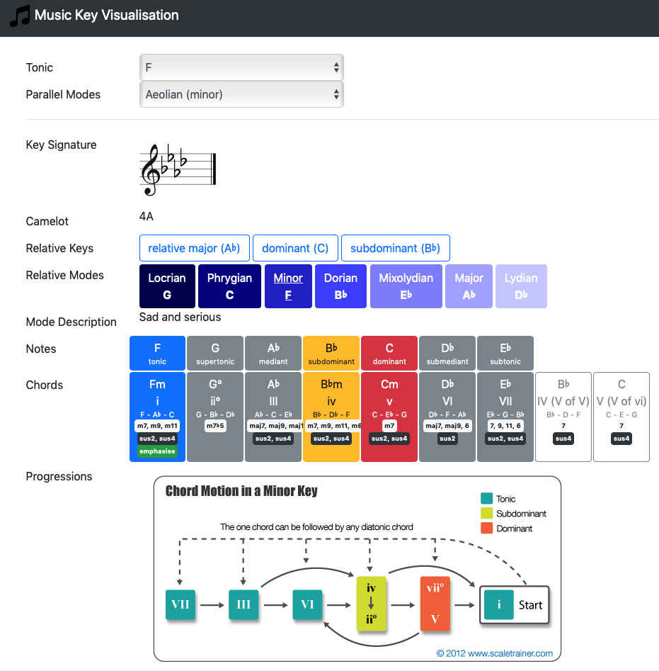

# Music Key Visualization

A quick and ready reference guide to all common music keys and modes along with a lot of additional
snippets of useful information collected from around the web.

Simply select the tonic and the mode and this page will show a customized view of that music key.

[click here](https://htmlpreview.github.io/?https://github.com/tonbut/MusicKeyVisualization/blob/main/index.html) to view live page.

## Notes
- Camelot refers to the [Mixed In Key Camelot Wheel number](https://mixedinkey.com/harmonic-mixing-guide/) that is an alternate notation for major and minor keys used in EDM.
- The chord section shows valid chord variants of valid 7ths, 9ths, and 11ths in white.
- The chord section shows valid chord variants of suspended 2nds and 4ths in black.
- The chord section shows the chord to emphasise for any particular mode in green.
- Progression section shows common chord motions for a particular key.